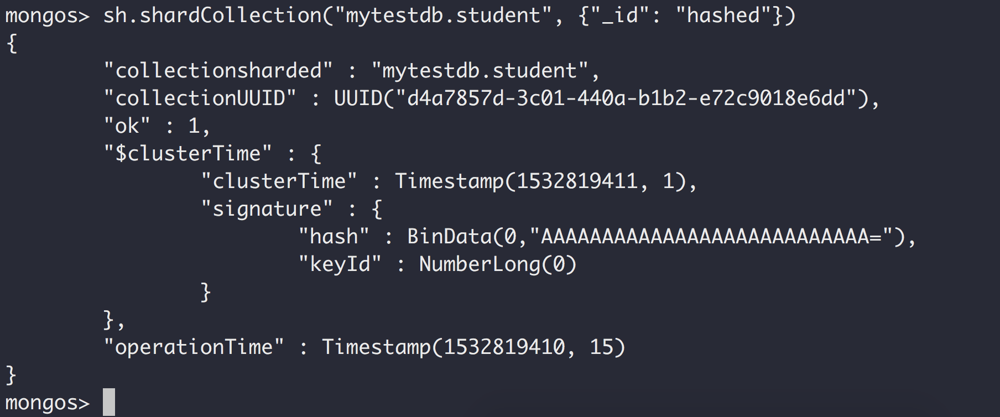

## MongoDB分片配置

### 关于MongoDB分片的组件：

Sharding Cluster(分片集群)共有3个组件:

#### Shard(也可以配置成副本集，确保高可用)

#### Query Router(查询路由器, mongos)

#### Config Server(配置服务器, 一般会配置成副本集，确保高可用)

要想对集合进行分片，首先需要选择一个片键。

#### 片键要么是一个索引字段，要么是一个复合索引字段。同时这个片键必须要存在于集合中的每个文档当中。

#### 每个数据库都会持有一个 “primary” shard, 它持有该数据库中所有未分片的集合。

> 分片是针对集合的不是数据库的

关于MongoDB分片的最佳实践：
> 1.要确保MongoDB能够比较均匀地在各个分片上面分布数据。

> 2.要确保MongoDB能够在各个分片上面平均分布写操作。

> 3.要确保mongos能够将大多数查询隔离到特定的mongod节点上。

分片是以集合为目标的，而不是以数据库为目标的。

### 分片机器数说明

第一阶段：

> 1.配置服务器：一台mongod实例。

> 2.mongos路由：一台mongos实例。

> 3.shard节点：两个shard构成，每个shard中有一台mongod实例

第二阶段：

> 1.配置服务器：是一个副本集，由3台mongod实例。

> 2.mongos路由：两台mongos实例。

> 3.shard节点：两个shard构成，每个shard都是一个副本集(包含了3个mongod实例)

11台机器

#### 关于配置服务器

> 1.不能拥有arbiter。

> 2.不能拥有delayed member。

> 3.必须能够build index(buildIndexes属性不能为false)。

### 第一阶段

#### 启动配置服务器(必须是集群，不然mongos连不上)

> mongod --configsvr --replSet svrset --port 30001 --dbpath ~/Desktop/sharding/config_server0/data

> mongod --configsvr --replSet svrset --port 30002 --dbpath ~/Desktop/sharding/config_server1/data

> mongod --configsvr --replSet svrset --port 30002 --dbpath ~/Desktop/sharding/config_server2/data

配置副本集
> rs.initiate({"_id": "svrset", configsvr: true, members:\[{_id: 0, host: 'localhost:30000'}, {_id:1, host:'localhost:30001'}, {_id: 2, host: 'localhost:30002'}]})

#### 启动mongos路由
> mongos --configdb svrset/localhost:30000,localhost:30001,localhost:30002 --port 40000

#### 启动shard服务器(必须加上--shardsvr)
> mongod --shardsvr --dbpath ~/Desktop/sharding/mongod1/data/ --port 50001

> mongod --shardsvr --dbpath ~/Desktop/sharding/mongod2/data/ --port 50002

#### 将分片服务器添加到配置服务器
> sh.addShard("localhost:50001")

> sh.addShard("localhost:50002")

查看分片信息
> use admin

> db.runCommand({listShards: 1})

查看分片状态信息
> sh.status()

> db.printShardingStatus()

#### 对数据库开启分片(数据库可以不存在)
> sh.enableSharding("mytestdb")

#### 集合开启sharding(集合名称: mytestdb.student, 片键: _id, 按照hash分片， hash base)

> sh.shardCollection("mytestdb.student", {"_id": "hashed"})

向集合添加数据
> use mytestdb

> for(var i = 0; i < 100; i++){db.student.insert({username: 'hello' + i});}

#### 按范围分片(range base)

> sh.shardCollection('mytestdb.person', {username: 1})

> for(var i = 0; i < 100; i++){db.person.insert({username: 'world' + i});}

> db.person.getIndexes()

### 第二阶段

配置服务器：
> config1: 28010
> config2: 28011
> config3: 28012

#### 启动配置服务器

#### 启动3台
> mongod --configsvr --replSet mytest --port 28010 --dbpath ~/Desktop/sharding2/config_server/config1/data --logpath ~/Desktop/sharding2/config_server/config1/log/log.log --logappend --fork

> mongod --configsvr --replSet mytest --port 28011 --dbpath ~/Desktop/sharding2/config_server/config2/data --logpath ~/Desktop/sharding2/config_server/config2/log/log.log --logappend --fork

> mongod --configsvr --replSet mytest --port 28012 --dbpath ~/Desktop/sharding2/config_server/config3/data --logpath ~/Desktop/sharding2/config_server/config3/log/log.log --logappend --fork

#### 配置副本集(configsvr必须设置为true)

> rs.initiate({_id: 'mytest', configsvr: true, members: \[{_id: 0, host: 'localhost:28010'}, {_id: 1, host: 'localhost:28011'}, {_id: 2, host: 'localhost:28012'}]})

### 启动mongos

#### 启动2台
> mongos --configdb mytest/localhost:28010,localhost:28011,localhost:28012 --port 29010

> mongos --configdb mytest/localhost:28010,localhost:28011,localhost:28012 --port 29011

配置服务器也可以指定一台，会自动识别整个集群的机器

> mongos --configdb mytest/localhost:28010 --port 29011

### 启动分片

#### 启动两个分片副本集(共六台机器)

启动分片副本集1(必须加上--shardsvr)：
> mongod --shardsvr --replSet shard1 --port 40001 --dbpath ~/Desktop/sharding2/shard1/mongod1/data

> mongod --shardsvr --replSet shard1 --port 40002 --dbpath ~/Desktop/sharding2/shard1/mongod2/data

> mongod --shardsvr --replSet shard1 --port 40003 --dbpath ~/Desktop/sharding2/shard1/mongod3/data

初始化shard1副本集

> rs.initiate({_id: 'shard1', members: \[{_id: 0, host: 'localhost:40001'}, {_id: 1, host: 'localhost:40002'}, {_id: 2, host: 'localhost:40003'}]})

启动分片副本集2(必须加上--shardsvr)：

> mongod --shardsvr --replSet shard2 --port 50001 --dbpath ~/Desktop/sharding2/shard2/mongod4/data

> mongod --shardsvr --replSet shard2 --port 50002 --dbpath ~/Desktop/sharding2/shard2/mongod5/data

> mongod --shardsvr --replSet shard2 --port 50003 --dbpath ~/Desktop/sharding2/shard2/mongod6/data

初始化shard2副本集

> rs.initiate({_id: 'shard2', members: \[{_id: 0, host: 'localhost:50001'}, {_id: 1, host: 'localhost:50002'}, {_id: 2, host: 'localhost:50003'}]})

### 将shard添加到配置服务器

连接到mongos(任意一台都行)

> mongo localhost:29010 或 mongo localhost:29011

将分片副本集1添加到配置服务器(只需添加一台就行，如: "shard1/localhost:40001")

> sh.addShard("shard1/localhost:40001,localhost:40002,localhost:40003")

将分片副本集2添加到配置服务器(只需添加一台就行，如: "shard2/localhost:50001")

> sh.addShard("shard2/localhost:50001,localhost:50002,localhost:50003")

查看分片信息

> use admin

> db.runCommand({listshards:1})

### 给数据库及集合开启分片

对数据库开启分片

> sh.enableSharding('mytest')

对集合开启分片

> sh.shardCollection("mytest.student", {_id: 'hashed'})

需要在分片服务器上先执行下面的命令才能进行操作
> rs.slaveOk()

