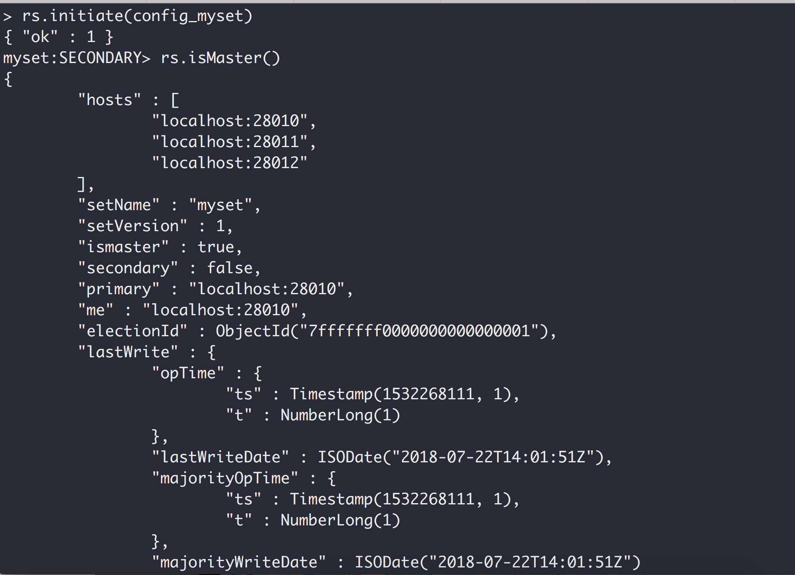
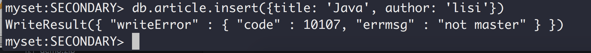

## MongoDB副本集配置

### 搭建副本集的四要素：
> 1.MongoDB数据文件存储路径。

> 2.MongoDB日志文件存储路径

> 3.MongoDB key 文件存储路径(什么是key文件， 就是一个普通文本文件，只要保证复制集中所有key文件内容相同就行)

> 4.MongoDB 实例监听端口号

#### 目录结构

报错：key文件权限太大
> 2018-07-22T21:06:51.284+0800 I CONTROL  \[main] ***** SERVER RESTARTED *****
> 2018-07-22T21:06:51.303+0800 I ACCESS   \[main] permissions on /Users/wujinqing/Desktop/data/key/key0/key0 are too open

解决方法: 给key文件降低权限

> chmod 400 data/key/key0/key0

#### 启动各个服务器

启动第一台服务，所有服务的复制集名称要一样myset，端口号不能一样:

> mongod --replSet myset --keyFile /Users/wujinqing/Desktop/data/key/key0/key0 --port 28010 --dbpath /Users/wujinqing/Desktop/data/data/data0 --logpath /Users/wujinqing/Desktop/data/log/log0/log0.log --logappend

启动第二台服务:
> mongod --replSet myset --keyFile /Users/wujinqing/Desktop/data/key/key1/key1 --port 28011 --dbpath /Users/wujinqing/Desktop/data/data/data1 --logpath /Users/wujinqing/Desktop/data/log/log1/log1.log --logappend

启动第三台服务:

> mongod --replSet myset --keyFile /Users/wujinqing/Desktop/data/key/key2/key2 --port 28012 --dbpath /Users/wujinqing/Desktop/data/data/data2 --logpath /Users/wujinqing/Desktop/data/log/log2/log2.log --logappend

#### 如何通过mongo客户端配置副本集

> {_id: 'myset', members: \[{_id: 0, host: 'localhost:28010'}, {_id: 1, host: 'localhost:28011'}, {_id: 2, host: 'localhost:28012'}]}

> _id: 'myset'必须是--replSet指定的副本集名称。

> members：集群中所有的机器

#### 初始化副本集

> rs.initiate(config_myset)

#### 判断当前机器的状态，是否为主机器: rs.isMaster()

> rs.isMaster()

#### rs.status() 列出副本集中所有机器的信息

#### 主从同步是通过oplog来异步实现的

### 不指定key文件(指定了key文件需要验证用户名密码才能登陆mongo)

> mongod --replSet myset --port 28010 --dbpath /Users/wujinqing/Desktop/data/data/data0 --logpath /Users/wujinqing/Desktop/data/log/log0/log0.log --logappend

> mongod --replSet myset --port 28011 --dbpath /Users/wujinqing/Desktop/data/data/data1 --logpath /Users/wujinqing/Desktop/data/log/log1/log1.log --logappend

> mongod --replSet myset --port 28012 --dbpath /Users/wujinqing/Desktop/data/data/data2 --logpath /Users/wujinqing/Desktop/data/log/log2/log2.log --logappend

### db.getMongo().setSlaveOk() 或者rs.slaveOk()  对于SECONDARY机器需要执行该操作才能执行查询操作

### 不能在从节点上执行写操作，否则会报错

### 关于副本集的原理分析

> 1.副本集中有且只有一个PRIMARY节点，PRIMARY和SECONDARY之间的数据复制是通过异步进行的，并且通过oplog进行。

> 2.副本集中的机器数最好为奇数。

> 3.PRIMARY接收所有的写操作(无法改变的)，默认情况下读操作也是在PRIMARY上，我们可以配置read preference（读首选项）, 使得读操作可以发生在SECONDARY机器上。如果读操作发生在PRIMARY机器上，那么读就是强一致性，如果读发生在SECONDARY机器上可能出现数据不一致的情况。

> 4.副本集中最多有50台机器，之前的版本最多有12台机器。如果超过了50台，那么只能使用master-slave方式，不过如果使用master-slave方式，那么就失去了自动化的failover机制。

> 5.Arbiter机器(仲裁机器)，它本身并不存放数据，仅提供选举功能。

> 6.不要将arbiter机器放在primary或者secondary机器上。

> 7.对于secondary机器，可以进行如下配置: a) 禁止某台secondary机器成为primary机器，priority为0。b) 禁止客户端读取某台secondary机器成员，隐藏成员。c）仅记录历史快照的secondary，延迟成员。比如延迟一小时。

> 8.最常见的secondary机器依然是进行数据异步复制与保持系统高可用的形式。

> 9.副本集中最多有50台机器，其中具有投票功能的机器数量最多是7台。

> 10.Priority为0的机器：无法成为primary的。

> 11.关于MongoDB的读写分离：a) 如果进行读写分离，那么要注意到读会有延迟。b) Secondary机器要通过oplog异步复制primary机器上的数据，因此从整体上来看，primary与secondary机器的读速度是大体相当的。c) 默认情况下，MongoDB的读写都是在primary上进行的。

> 12.关于Read preference(读首选项):

> a) primary(默认值): 读操作在primary机器上进行

> b) primaryPreferred:正常是在读操作在primary机器上进行，当primary挂了，没有primary机器时读操作在secondary机器上进行.

> c) secondary: 所有读操作都在secondary机器上读。

> d) secondaryPreferred: 首先读操作都在secondary机器上进行，如果secondary机器不可用则读操作在primary机器上进行。

> e) nearest: 读取网络延迟最少的不管primary还是secondary。

> 13.关于延迟成员(delayed member)
> a) 延迟成员的priority必须为0，表示它无法成为primary。

> b) 延迟成员也是隐藏成员。应用是无法通过延迟成员查询数据的。

> c) 可以对primary的选举进行投票。

> 14.请确保副本集中成员的个数为奇数，如果是偶数的话，请添加一个arbiter成员。

> 15.关于MongoDB投票与故障恢复：

> a) MongoDB要求投票时系统中可用的机器数量要是全副本集成员的大多数(> 1/2)。

> 16.向副本集中添加成员并不总是会确保系统的故障恢复能力，不过这样做可以实现一些额外的功能：备份统计报表等。

### 如何动态的向副本集中添加机器？

必须在primary机器上进行添加操作。

> rs.add("localhost:28013")

> mongod --replSet myset --port 28013 --dbpath /Users/wujinqing/Desktop/data/data/data3 --logpath /Users/wujinqing/Desktop/data/log/log3/log3.log --logappend

buildIndexes: 主的上构建了索引从的上是否也构建索引，默认是

> rs.add({_id: 10, host: 'localhost:28013', priority: 0, hidden: true})

### 从副本集中删除一台机器

必须在primary机器上进行操作。

> rs.remove("localhost:28013")

### 修改副本集配置信息

> config = rs.conf()

> config.members\[3].hidden = false

> config.members\[3].priority = 1

> rs.reconfig(config)

### 副本集支持的方法

