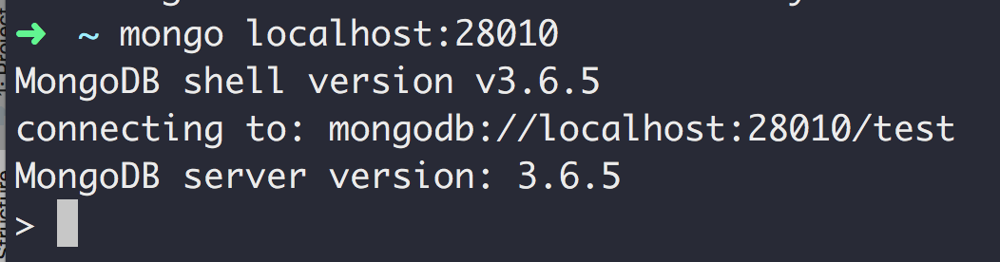

## MongoDB副本集配置

### 搭建副本集的四要素：
> 1.MongoDB数据文件存储路径。

> 2.MongoDB日志文件存储路径

> 3.MongoDB key 文件存储路径(什么是key文件， 就是一个普通文本文件，只要保证复制集中所有key文件内容相同就行)

> 4.MongoDB 实例监听端口号

#### 目录结构

报错：key文件权限太大
> 2018-07-22T21:06:51.284+0800 I CONTROL  \[main] ***** SERVER RESTARTED *****
> 2018-07-22T21:06:51.303+0800 I ACCESS   \[main] permissions on /Users/wujinqing/Desktop/data/key/key0/key0 are too open

解决方法: 给key文件降低权限

> chmod 400 data/key/key0/key0

#### 启动各个服务器

启动第一台服务，所有服务的复制集名称要一样myset，端口号不能一样:

> mongod --replSet myset --keyFile /Users/wujinqing/Desktop/data/key/key0/key0 --port 28010 --dbpath /Users/wujinqing/Desktop/data/data/data0 --logpath /Users/wujinqing/Desktop/data/log/log0/log0.log --logappend

启动第二台服务:
> mongod --replSet myset --keyFile /Users/wujinqing/Desktop/data/key/key1/key1 --port 28011 --dbpath /Users/wujinqing/Desktop/data/data/data1 --logpath /Users/wujinqing/Desktop/data/log/log1/log1.log --logappend

启动第三台服务:

> mongod --replSet myset --keyFile /Users/wujinqing/Desktop/data/key/key2/key2 --port 28012 --dbpath /Users/wujinqing/Desktop/data/data/data2 --logpath /Users/wujinqing/Desktop/data/log/log2/log2.log --logappend

#### 如何通过mongo客户端配置副本集

> {_id: 'myset', members: \[{_id: 0, host: 'localhost:28010'}, {_id: 1, host: 'localhost:28011'}, {_id: 2, host: 'localhost:28012'}]}

> _id: 'myset'必须是--replSet指定的副本集名称。

> members：集群中所有的机器

#### 初始化副本集

> rs.initiate(config_myset)

### 判断当前机器的状态，是否为主机器: rs.isMaster()

> rs.isMaster()

