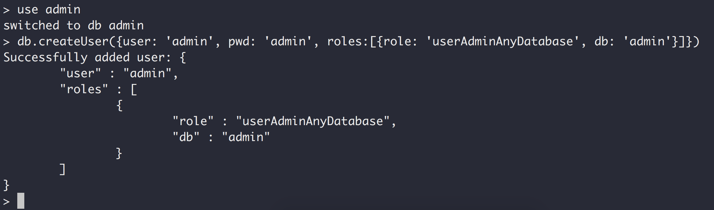
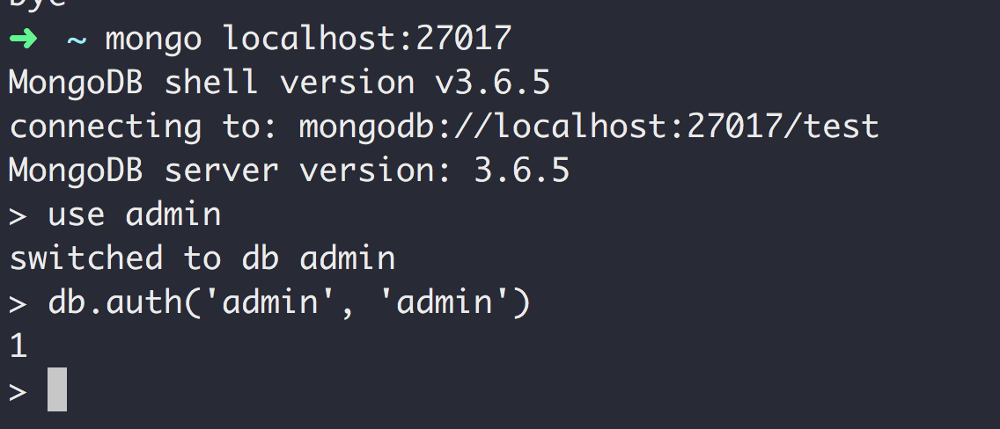
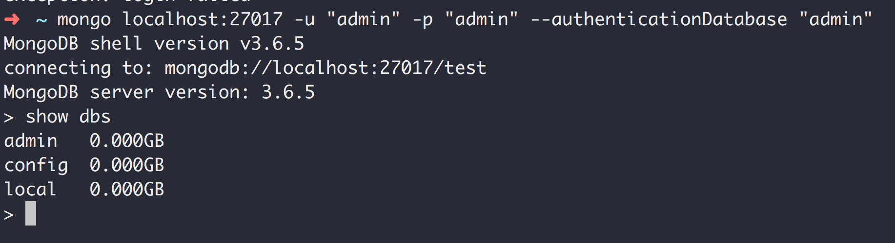

## MongoDB权限

### 初始化权限

#### 第一步: 启动服务器mongod(首次不开启权限启动)

> mongod --port 27017  --dbpath ~/Desktop/auth/data

#### 第二步: 启动客户端mongo连接到服务器(首次不需要权限)

> mongo localhost:27017

#### 第四步: 切换到admin数据库
> use admin

#### 第五步: 创建用户

> db.createUser({user: 'admin', pwd: 'admin', roles: \[{role: 'userAdminAnyDatabase', db: 'admin'}]})

#### 第六步: 重新启动服务器mongod(需要开启权限, 启动时加上--auth参数)

> mongod --auth --port 27017  --dbpath ~/Desktop/auth/data

#### 第七步: 重新用mongo客户端使用账号密码连接到服务器

##### 方式一: 先不指定用户名密码启动客户端
> mongo localhost:27017

> use admin

> db.auth('admin', 'admin')

##### 方式一: 指定用户名密码启动客户端

> mongo localhost:27017 -u "admin" -p "admin" --authenticationDatabase "admin"

