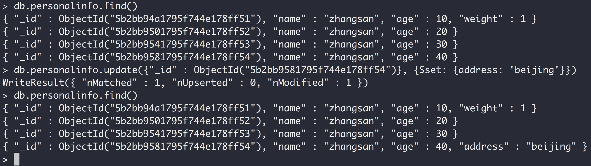

### MongoDB笔记

#### 官网: https://www.mongodb.com


#### 下载页面


#### bin目录


#### mongod是服务器

#### mongo是客户端

### 启动服务器, mongod


> 默认端口号是：27017

### 启动一个客户端, mongo


### 查看所有数据库

> show dbs


1.mongodb的存储格式是json的格式。
2.MongoDB的函数是通过JavaScript实现的。


### 使用数据库

> use test;  切换到test数据库


### 查看当前数据库

> db


### 向集合hello中插入一个文档
>  db.hello.insert({name:'zhangsan', age: 20});


> 同一个字段数据类型不一样


> MongoDB是模式自由的可以向同一个集合中插入任何东西.


### 查出一个集合中的所有记录

> db.hello.find();


### 查询限制个数

> db.hello.find().limit(2); 查询前两条


### 删除集合中的所有数据

> db.hello.remove({});  花括号不能省略


### 查看一个命令的具体实现

> db.hello.find; 不需要括号


## MongoDB修改器(update)


> mongodb的应用场景主要是用在多台机器进行分片和复制集，所以他的索引不是自增的，而是"_id" : ObjectId("5b2adfb11795f744e178ff4d"),

> 由时间戳、机器hash码，进程ID等数据生成的, 同一个集合的id不会重复，但不同的集合允许重复。id值可以自己提供或者MongoDB自动生成。


### 查询并返回符合条件的第一条findOne()

> db.personalinfo.findOne({name: 'zhangsan'})


### update(query, obj, upsert, multi) 四个参数

1.query：第一个参数是更新条件，哪些数据要被更新。

2.obj：第二个参数待更新的新的文档。

3.upsert：第三个参数是一个boolean值表示目标集合中没有这个信息的话就插入进去。

4.第四个参数是如果查询出多条是否更新多条，默认只更新第一条。


> db.personalinfo.update({name: 'zhangsan'}, info)


> db.personalinfo.update({name: 'zhangsan'}, zhangsan) 只会更新第一条


var zhangsan = db.personalinfo.findOne({age: 40})

db.personalinfo.update({name: 'zhangsan'}, zhangsan)

修改的是第四条记录，更新的是第一条记录，直接报错。


修改器都是原子操作。以$符号开头

### $inc修改器

> db.personalinfo.update({"_id": ObjectId("5b2bb94a1795f744e178ff51")}, {"$inc": {"age": 1}})


> 查找ID为ObjectId("5b2bb94a1795f744e178ff51")记录，并将其age值加1.

$inc:

> 是一个增加修改器， 如果后面的值是正数就是增加负数就是减少(没有对应的减少修改器)， 仅仅只能修改数字(整数和浮点数)，
> 不能用它来修改字符串、bool值等等。如果目标属性不存在会自动添加进去

> db.personalinfo.update({name:'zhangsan'}, {"$inc": {age: -3}})


### $set 修改器：动态的添加属性, 如果属性存在就修改它，另外还可以修改类型

db.personalinfo.update({"_id" : ObjectId("5b2bb9581795f744e178ff54")}, {$set: {address: 'beijing'}})

添加：



修改值：


修改类型:


### $unset 修改器：删除某个属性1或者true表示删除

db.personalinfo.update({"_id" : ObjectId("5b2bb9581795f744e178ff54")}, {$unset: {address: 1}})


修改嵌入式文档(属性需要用引号引起来，不然会报错)

> db.personalinfo.update({"_id" : ObjectId("5b2bb9581795f744e178ff54")}, {$set: {'address.city': 'shanghai'}})


### $push修改器： 对数组进行操作

db.personalinfo.update({"_id" : ObjectId("5b2bb94a1795f744e178ff51")}, {$push: {books: 'Mongo DB'}})


### show collections 查看当前数据库下的所有集合


### $addToSet 向集合中添加元素，不能重复， 如果存在则不添加

> db.personalinfo.update({"_id" : ObjectId("5b2c35a61795f744e178ff55")}, {'$addToSet': {email: 'c@c.com'}})


### $pop 弹出并删除一个元素 1 表示从尾删除，-1表示从头删除

> db.personalinfo.update({"_id" : ObjectId("5b2c35a61795f744e178ff55")}, {"$pop": {"email": 1}})


### $each 同时添加多个元素

> db.personalinfo.update({"_id" : ObjectId("5b2c35a61795f744e178ff55")}, {"$addToSet": {"email": {"$each": \['d@d.com', 'e@e.com', 'f@f.com']}}})

错误做法:

> db.personalinfo.update({"_id" : ObjectId("5b2c35a61795f744e178ff55")}, {'$addToSet': {email: \['d@d.com', 'e@e.com']}})


### $pull 删除指定值的所有元素

> db.personalinfo.update({"_id" : ObjectId("5b2c35a61795f744e178ff55")}, {"$pull": {"email": "d@d.com"}})


### "email.0" 按数组下标修改元素

> db.personalinfo.update({"_id" : ObjectId("5b2c35a61795f744e178ff55")}, {"$set": {"email.0": "d@d.com"}})


### 删除集合

> db.personal.drop()


### $ 匹配你所查到的那条记录(不知道数组下标)

> db.personalinfo.update({"address.city": "beijing"}, {"$set": {"address.$.street": "chaoyang"}})


### "address\[0].city" 不能使用这种方式

> db.personalinfo.update({"_id" : ObjectId("5b31731e1795f744e178ff56")}, {"$set": {"address[0].city": "hangzhou"}})


### update(query, obj, upsert, multi)

> query: 查询条件

> obj: 修改对象

> upsert: update/insert 如果没有匹配对象是否插入对象obj，默认不插入。

> multi: 默认情况下只更新查出来的第一条，设置为true表示会更新所有查询出来的文档。


### upsert设置为true, 没有匹配项就插入(把查询条件和修改对象结合起来插入)

> db.personalinfo.update({"name": "lisi"}, {"$inc": {"count": 3}}, true)


把查询条件和修改对象结合起来插入


multi: true 修改多条


### insert与save的区别

> insert如果集合里面没有记录就插入，有的话就什么都不做。

> save如果集合里面没有记录就插入，有的话就更新。


### getLastError 获取最近一次修改的影响行数


### db.runCommand(obj, extra, queryOptions)执行某个命令(另一种方式执行，如：db.personalinfo.update)

### MongoDB的特点：客户端发送命令(如：插入)，无需等待执行结果，也不管成功与否就立马返回，所以很快。


### MongoDB本身并没有事务的概念

### findAndModify 原子操作，只会更新一条记录，返回老的或者新的记录，默认返回老的记录

```javascript
db.collection.findAndModify({
    query: <document>,
    sort: <document>,
    remove: <boolean>,
    update: <document>,
    new: <boolean>,
    fields: <document>,
    upsert: <boolean>,
    bypassDocumentValidation: <boolean>,
    writeConcern: <document>,
    collation: <document>,
    arrayFilters: [ <filterdocument1>, ... ]
});

```

> query：查询条件，如果匹配到多个仅仅只会选择一个去修改。

> sort: 排序字段，类似order by. 指定哪些键来升序还是倒序。

> remove: remove和update只能指定一个，不能都有。如果设置为true,会将查询出来的第一条文档删除，默认是false。

> update: 指定修改的文档对象。

> new: 默认false, 返回修改之前的文档，如果设置为true，将返回修改之后的新文档，对删除操作无效(会忽略掉这个选项)。

> fieds: 指定需要返回的字段，fields: { field1: 1, field2: 1, ... }.

> upsert：当设置为true, 当查询没有返回数据，将会插入。默认false
>
>

```javascript
db.personalinfo.findAndModify({
query: {name: "zhangsan"},
sort: {age: -1},

update: {$set: {address: "ganzhou"}},
new: true
})

```


