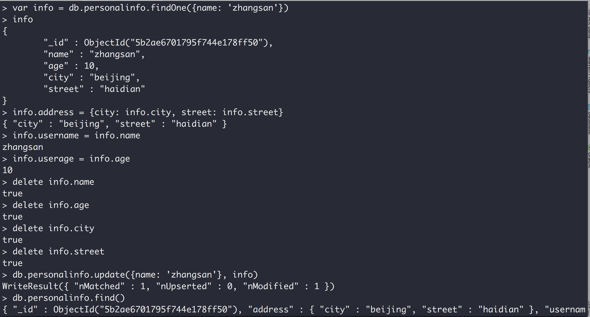
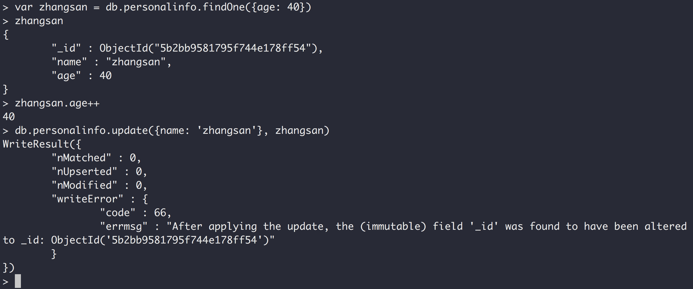
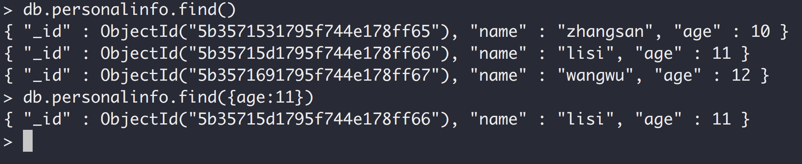
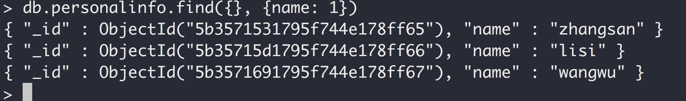

### MongoDB笔记

#### 官网: https://www.mongodb.com


#### 下载页面


#### bin目录


#### mongod是服务器

#### mongo是客户端

### 启动服务器, mongod


> 默认端口号是：27017

### 启动一个客户端, mongo


### 查看所有数据库

> show dbs


1.mongodb的存储格式是json的格式。
2.MongoDB的函数是通过JavaScript实现的。


### 使用数据库

> use test;  切换到test数据库


### 查看当前数据库

> db


### 向集合hello中插入一个文档
>  db.hello.insert({name:'zhangsan', age: 20});


> 同一个字段数据类型不一样


> MongoDB是模式自由的可以向同一个集合中插入任何东西.


### 查出一个集合中的所有记录

> db.hello.find();


### 查询限制个数

> db.hello.find().limit(2); 查询前两条


### 删除集合中的所有数据

> db.hello.remove({});  花括号不能省略


### 查看一个命令的具体实现

> db.hello.find; 不需要括号


## MongoDB修改器(update)


> mongodb的应用场景主要是用在多台机器进行分片和复制集，所以他的索引不是自增的，而是"_id" : ObjectId("5b2adfb11795f744e178ff4d"),

> 由时间戳、机器hash码，进程ID等数据生成的, 同一个集合的id不会重复，但不同的集合允许重复。id值可以自己提供或者MongoDB自动生成。


### 查询并返回符合条件的第一条findOne()

> db.personalinfo.findOne({name: 'zhangsan'})


### update(query, obj, upsert, multi) 四个参数

1.query：第一个参数是更新条件，哪些数据要被更新。

2.obj：第二个参数待更新的新的文档。

3.upsert：第三个参数是一个boolean值表示目标集合中没有这个信息的话就插入进去。

4.第四个参数是如果查询出多条是否更新多条，默认只更新第一条。




> db.personalinfo.update({name: 'zhangsan'}, info)


> db.personalinfo.update({name: 'zhangsan'}, zhangsan) 只会更新第一条


var zhangsan = db.personalinfo.findOne({age: 40})

db.personalinfo.update({name: 'zhangsan'}, zhangsan)

修改的是第四条记录，更新的是第一条记录，直接报错。




修改器都是原子操作。以$符号开头

### $inc修改器

> db.personalinfo.update({"_id": ObjectId("5b2bb94a1795f744e178ff51")}, {"$inc": {"age": 1}})


> 查找ID为ObjectId("5b2bb94a1795f744e178ff51")记录，并将其age值加1.

$inc:

> 是一个增加修改器， 如果后面的值是正数就是增加负数就是减少(没有对应的减少修改器)， 仅仅只能修改数字(整数和浮点数)，
> 不能用它来修改字符串、bool值等等。如果目标属性不存在会自动添加进去

> db.personalinfo.update({name:'zhangsan'}, {"$inc": {age: -3}})


### $set 修改器：动态的添加属性, 如果属性存在就修改它，另外还可以修改类型

db.personalinfo.update({"_id" : ObjectId("5b2bb9581795f744e178ff54")}, {$set: {address: 'beijing'}})

添加：


修改值：


修改类型:


### $unset 修改器：删除某个属性1或者true表示删除

db.personalinfo.update({"_id" : ObjectId("5b2bb9581795f744e178ff54")}, {$unset: {address: 1}})


修改嵌入式文档(属性需要用引号引起来，不然会报错)

> db.personalinfo.update({"_id" : ObjectId("5b2bb9581795f744e178ff54")}, {$set: {'address.city': 'shanghai'}})


### $push修改器： 对数组进行操作

db.personalinfo.update({"_id" : ObjectId("5b2bb94a1795f744e178ff51")}, {$push: {books: 'Mongo DB'}})


### show collections 查看当前数据库下的所有集合


### $addToSet 向集合中添加元素，不能重复， 如果存在则不添加

> db.personalinfo.update({"_id" : ObjectId("5b2c35a61795f744e178ff55")}, {'$addToSet': {email: 'c@c.com'}})


### $pop 弹出并删除一个元素 1 表示从尾删除，-1表示从头删除

> db.personalinfo.update({"_id" : ObjectId("5b2c35a61795f744e178ff55")}, {"$pop": {"email": 1}})


### $each 同时添加多个元素

> db.personalinfo.update({"_id" : ObjectId("5b2c35a61795f744e178ff55")}, {"$addToSet": {"email": {"$each": \['d@d.com', 'e@e.com', 'f@f.com']}}})

错误做法:

> db.personalinfo.update({"_id" : ObjectId("5b2c35a61795f744e178ff55")}, {'$addToSet': {email: \['d@d.com', 'e@e.com']}})


### $pull 删除指定值的所有元素

> db.personalinfo.update({"_id" : ObjectId("5b2c35a61795f744e178ff55")}, {"$pull": {"email": "d@d.com"}})


### "email.0" 按数组下标修改元素

> db.personalinfo.update({"_id" : ObjectId("5b2c35a61795f744e178ff55")}, {"$set": {"email.0": "d@d.com"}})


### 删除集合

> db.personal.drop()


### $ 匹配你所查到的那条记录(不知道数组下标)

> db.personalinfo.update({"address.city": "beijing"}, {"$set": {"address.$.street": "chaoyang"}})


### "address\[0].city" 不能使用这种方式

> db.personalinfo.update({"_id" : ObjectId("5b31731e1795f744e178ff56")}, {"$set": {"address[0].city": "hangzhou"}})


### update(query, obj, upsert, multi)

> query: 查询条件

> obj: 修改对象

> upsert: update/insert 如果没有匹配对象是否插入对象obj，默认不插入。

> multi: 默认情况下只更新查出来的第一条，设置为true表示会更新所有查询出来的文档。


### upsert设置为true, 没有匹配项就插入(把查询条件和修改对象结合起来插入)

> db.personalinfo.update({"name": "lisi"}, {"$inc": {"count": 3}}, true)


把查询条件和修改对象结合起来插入


multi: true 修改多条


### insert与save的区别

> insert如果集合里面没有记录就插入，有的话就什么都不做。

> save如果集合里面没有记录就插入，有的话就更新。


### getLastError 获取最近一次修改的影响行数


### db.runCommand(obj, extra, queryOptions)执行某个命令(另一种方式执行，如：db.personalinfo.update)

### MongoDB的特点：客户端发送命令(如：插入)，无需等待执行结果，也不管成功与否就立马返回，所以很快。


### MongoDB本身并没有事务的概念

### findAndModify 原子操作，只会更新一条记录，返回老的或者新的记录，默认返回老的记录

```javascript
db.collection.findAndModify({
    query: <document>,
    sort: <document>,
    remove: <boolean>,
    update: <document>,
    new: <boolean>,
    fields: <document>,
    upsert: <boolean>,
    bypassDocumentValidation: <boolean>,
    writeConcern: <document>,
    collation: <document>,
    arrayFilters: [ <filterdocument1>, ... ]
});

```

> query：查询条件，如果匹配到多个仅仅只会选择一个去修改。

> sort: 排序字段，类似order by. 指定哪些键来升序还是倒序。

> remove: remove和update只能指定一个，不能都有。如果设置为true,会将查询出来的第一条文档删除，默认是false。

> update: 指定修改的文档对象。

> new: 默认false, 返回修改之前的文档，如果设置为true，将返回修改之后的新文档，对删除操作无效(会忽略掉这个选项)。

> fieds: 指定需要返回的字段，fields: { field1: 1, field2: 1, ... }.

> upsert：当设置为true, 当查询没有返回数据，将会插入。默认false
>
>

```javascript
db.personalinfo.findAndModify({
    query: {name: "zhangsan"},
    sort: {age: -1},
    update: {$set: {address: "ganzhou"}},
    new: true
})

```


```javascript
db.personalinfo.findAndModify({
    query: {name: "zhangsan"},
    sort: {age: -1},
    update: {$set: {address: "jian"}},
    new: true,
    fields: {name: 1, address: 1}
})

```


### MongoDB查询

MongoDB的目标提供大批量数据的高效的查询。

查询就两个方法:

> db.collection.find()

> db.collection.findOne()

> find一般会带两个条件：一个查询条件，一个限制条件。

查询age等于11的所有记录

> db.personalinfo.find({age:11})



查询所有记录并返回name列(_id列默认都会返回), 返回: 1/true; 不返回: 0/false, 返回和不返回不能同时出现。

> db.personalinfo.find({}, {name: 1})

> db.personalinfo.find({}, {name: true})


所有字段都不返回，也会返回空文档


### $gt 大于， 语法：{field: {$gt: value} }

> db.personalinfo.find({age: {$gt: 10}})


### $gte 大于等于， 语法：{field: {$gte: value} }

> db.personalinfo.find({age: {$gte: 10}})


### $lt 小于， 语法：{field: {$lt: value} }

> db.personalinfo.find({age: {$lt: 11}})


### $lte 小于等于， 语法：{ field: { $lte: value} }

db.personalinfo.find({age: {$lte: 11}})


### 大于并且小于

> db.personalinfo.find({age: {$gt: 10, $lt: 12}})


### $in 类似于SQL里面的IN， 语法：{ field: { $in: \[value1, value2, ... valueN] } }

> db.personalinfo.find({name: {$in: \['lisi', 'wangwu']}})

### $nin 类似于SQL里面的NOT IN， 语法：{ field: { $nin: \[value1, value2, ... valueN] } }

> db.personalinfo.find({name: {$nin: \['lisi', 'wangwu']}})


### $eq 等于， 语法：{ field: { $eq: value } }

> db.personalinfo.find({name: {$eq: 'lisi'}})

等价于

> db.personalinfo.find({name: 'lisi'})


### $ne 不等于或者不包含指定字段， 语法：{field: {$ne: value} }

> db.personalinfo.find({name: {$ne: 'lisi'}})


### $all 包含全部元素, 目标字段必须是数组, 没有与SQL里面相对于的。， 语法：{ field: { $all: \[ value1 , value2 ... ] } }

> db.address.find({name: {$all: \['beijing', 'tianjing']}})


### 数组下标

name里面第二个元素等于tianjing的记录

> db.address.find({'name.1': 'tianjing'})


### $exists 包含或者不包含某个字段

> db.personalinfo.find({age: {$exists: true}})


### null： 字段值为null或者没有这个字段

> db.personalinfo.find({age:null})


### age为null且必须存在这个字段(排除不含这个字段的记录)

> db.personalinfo.find({age: {$eq: null, $exists:1}})


### 被5取模余数为2的数据

> db.personalinfo.find({age: {$mod: \[5, 2]}})


### $ne 不等于, 会返回为null的和不包含该字段的。

> db.personalinfo.find({age: {$ne: 5}})

去除为null的和不包含该字段的

> db.personalinfo.find({age: {$ne: 5, $exists:1, $ne: null}})


### $in 类似于SQL里面的IN

> db.personalinfo.find({age: {$in: \[11, 12]}})


### $nin 类似于SQL里面的NOT IN

> db.personalinfo.find({age: {$nin: \[11, 12]}})


### $size: 针对数组的操作， 数组长度为4的记录

> db.mydemo.find({myarray: {$size: 4}})


### $all: 针对数组的操作，myarray同时含有1和4的记录

> db.mydemo.find({myarray: {$all: \[1,4]}})


### $elemMatch 至少有一个元素匹配所有条件

> db.mydemo.find({myarray: {$elemMatch: {$gte: 4, $lte:5}}})


### 模糊查询

名字里面包含字母a的记录

> db.personalinfo.find({name: /a/})

名字以z开头

> db.personalinfo.find({name: /^z/})

名字以i结尾

> db.personalinfo.find({name: /i$/})


### $where 类似于SQL里面的WHERE

> db.personalinfo.find({$where: 'this.age > 10'})


### 直接所有JavaScript表达式，类似于SQL里面的存储过程

> db.personalinfo.find(myExp)


### 跨域多列的复杂查询

> db.test.find({$where: 'this.a + this.b + this.c == 11'})

> db.test.find({$where: 'function(){return this.a + this.b + this.c == 11;}'})


### count() 统计记录条数, 分页

> db.personalinfo.find().count()


### skip() 忽略掉前几条, 分页

忽略掉第一条

> db.personalinfo.find().skip(1)

忽略掉前两条

> db.personalinfo.find().skip(2)


### limit() 限制返回条数, 分页

> db.personalinfo.find().skip(1).limit(1)


### 返回加了限制条件后真实的记录条数

> db.personalinfo.find().skip(1).limit(1).count(true)

不能使用下面这个

> db.personalinfo.find().skip(1).limit(1).count()


### sort() 排序

升序

> db.personalinfo.find().sort({age: 1})

降序

> db.personalinfo.find().sort({age: -1})


### sort() 多字段排序

> db.personalinfo.find().sort({age: 1, name:-1})


### distinct() 去重

> db.personalinfo.distinct('age')

加了条件的去重
> db.personalinfo.distinct('age', {age: {$gt: 10}})

> db.runCommand({'distinct': 'personalinfo', key: 'age'})


### 聚合框架

group 无法操作分片，mapReduce可以。

已经分完组了， 每个组都会执行reduce函数。

定义：
> db.collection.group({ key, reduce, initial \[, keyf] \[, cond] \[, finalize] })

被废弃了
> Mongodb 3.4 deprecates the db.collection.group() method. Use db.collection.aggregate() with the $group stage or db.collection.mapReduce() instead.

初始化：
> for(var i = 1; i < 30; i++){ var count = i%5; db.mygroup.save({name: 'name'+i, count:count}); }

执行分组函数：
> db.mygroup.group({key: {count: true}, initial: {totalCount: 0}, reduce: function(current, aggregator){aggregator.totalCount++;}});

字段说明：
> key: 要分组的字段。

> initial: 分组后对每一组进行聚合操作时的初始值， 在每一个组里面是共享的，不同组里面是隔离的。

> reduce: 对于每一组中的每一条记录都会执行该函数，current表示当前记录，aggregator聚合器它的初始值是initial里面的对象，每个分组的aggregator都是独立的。

> key和initial里面的字段会被输出出来。


> db.mygroup.group({key: {count: true}, initial: {totalCount: 0}, reduce: function(current, aggregator){aggregator.totalCount+= current.count;}});


指定查询条件分组

> db.mygroup.group({key: {count: true}, initial: {totalCount: 0}, reduce: function(current, aggregator){aggregator.totalCount+= current.count;}, cond:{count: {$gt: 1}}});


注意：

> db.collection.group() 使用的是keyf和reduce；而group command 使用的是$keyf和$reduce。

求最大值

> for(var i = 1; i < 30; i++){ var count = i % 5; db.mygroup.insert({name: "name" + i, age: i, count: count}); }

> db.mygroup.group({key: {count: 1}, initial: {maxAge: -1}, reduce: function(current, aggregator){if(current.age > aggregator.maxAge){aggregator.maxAge = current.age;}}})


求最小值

> db.mygroup.group({key: {count: 1}, initial: {minAge: 0, myCount: 0}, reduce: function(current, aggregator){if(aggregator.myCount == 0){aggregator.minAge = current.age}else{if(current.age < aggregator.minAge){aggregator.minAge = current.age;}}aggregator.myCount++;}})


求平均值

> db.mygroup.group({key: {count: 1}, initial: {totalAge: 0, totalCount: 0}, reduce: function(current, aggregator){aggregator.totalAge += current.age; aggregator.totalCount++;}, finalize: function(aggregator){aggregator.avgAge = aggregator.totalAge / aggregator.totalCount;}})


删掉某些不需要的属性

> db.mygroup.group({key: {count: 1}, initial: {totalAge: 0, totalCount: 0}, reduce: function(current, aggregator){aggregator.totalAge += current.age; aggregator.totalCount++;}, finalize: function(aggregator){aggregator.avgAge = aggregator.totalAge / aggregator.totalCount;  delete aggregator.totalCount; delete aggregator.count; }})


按名字长度分组

> db.mygroup.group({keyf: function(current){return {name: current.name.length}}, initial: {totalAge: 0, totalCount: 0}, reduce: function(current, aggregator){aggregator.totalAge += current.age; aggregator.totalCount++;}, finalize: function(aggregator){aggregator.avgAge = aggregator.totalAge / aggregator.totalCount;  delete aggregator.totalCount; delete aggregator.count; }})


### Map-Reduce

#### Map-Reduce可以在分片的环境下执行，Group不能在分片的环境下执行

> Map-Reduce分为两个阶段: Map阶段，Reduce阶段。Reduce阶段的输入来自于Map的输出。所以Map是先执行的，Reduce是后执行的。

> Map映射作用，将相同key的值放到一个数组当中。

> Map函数里面必须调用emit()方法。

> 对于Map阶段后有多个值的key会进行Reduce阶段，一个值的不会(执行不执行reduce函数都没效果)。


#### mapReduce方法

```javascript
db.collection.mapReduce(
                         <map>,
                         <reduce>,
                         {
                           out: <collection>,
                           query: <document>,
                           sort: <document>,
                           limit: <number>,
                           finalize: <function>,
                           scope: <document>,
                           jsMode: <boolean>,
                           verbose: <boolean>,
                           bypassDocumentValidation: <boolean>
                         }
                       )

```

#### 示例

> for(var i = 1; i < 10 ;i++){ var count = i%3; db.student.insert({name: 'name'+i,age:i,count: count}); }

求记录条数

> db.student.mapReduce(function(){emit(this.count, 1)}, function(key, values){return values.length;}, {out: 'aa'})


求总和

> db.student.mapReduce(function(){emit(this.count, this.age)}, function(key, values){var totalAge = 0; for(var i = 0; i < values.length; i++){totalAge+=values[i];} return totalAge;}, {out: 'aa'})


> db.student.mapReduce(function(){emit(this.count, {age: this.age});}, function(key, values){var totalAge = 0; values.forEach(function(current){totalAge += current.age;}); return totalAge;}, {out: 'aa'})


### group reduce VS map reduce


group reduce:

方法签名：
> function(current, aggregator){}

> 各个分组里面有多少条数据方法就会执行多少次，aggregator每次执行该方法都在不断累加。该方法不断执行不知道什么时候执行完(组里面有多少条记录就会执行多少次)。


map reduce:

方法签名：

> function(key, values){}

> 各个分组只会执行一次。


求最大值：

> db.student.mapReduce(function(){emit(this.count, this.age);}, function(key, values){var maxAge = values[0]; values.forEach(function(current){if(current > maxAge){maxAge = current;}}); return maxAge;}, {out: 'aa'})


求最小值：

> db.student.mapReduce(function(){emit(this.count, this.age);}, function(key, values){var minAge = values[0]; values.forEach(function(current){if(current < minAge){minAge = current;}}); return minAge;}, {out: 'aa'})


求平均值：

> db.student.mapReduce(function(){emit(this.count, this.age);}, function(key, values){var totalAge = 0; values.forEach(function(current){totalAge += current;}); return totalAge / values.length;}, {out: 'aa'})


求标签出现的次数。

> var map = function(){this.tags.forEach(function(tag){emit(tag, 1)})}

> var reduce = function(key, values){var sum = 0; values.forEach(function(current){sum += current;}); return sum;}

> db.article.mapReduce(map, reduce, {out: "aa"})


### 内联的方式输出

> db.article.mapReduce(map, reduce, {out: {inline: true}})


### 当map中发射的值只有一个时是不会执行reduce函数的


> var reduce = function(key, values){var sum = 0; values.forEach(function(current){sum += current.count;}); return {count:sum};}

### map-reduce的finalize

> var map = function(){this.tags.forEach(function(tag){emit(tag, {count: 1})})}

> var reduce = function(key, values){var sum = 0; values.forEach(function(current){sum += current.count;}); return {count: sum};}

> var finalize = function(key, reducedValues){if(reducedValues.count == undefined){return reducedValues;}else{return reducedValues.count;}}

> db.article.mapReduce(map, reduce, {out: 'aa', finalize: finalize})


> db.runCommand({mapReduce: 'article', map: map, reduce: reduce, out: 'aa', finalize: finalize})


### map中过滤

> var map = function(){ var flag = false; for(i in this.tags){if(this.tags\[i] == 'java'){flag = true;}}; if(flag){  this.tags.forEach(function(tag){emit(tag, {count: 1})})}}

> var reduce = function(key, values){var sum = 0; values.forEach(function(current){sum += current.count;}); return {count: sum};}

> var finalize = function(key, reducedValues){if(reducedValues.count == undefined){return reducedValues;}else{return reducedValues.count;}}

> db.runCommand({mapReduce: 'article', map: map, reduce: reduce, out: 'aa', finalize: finalize})


