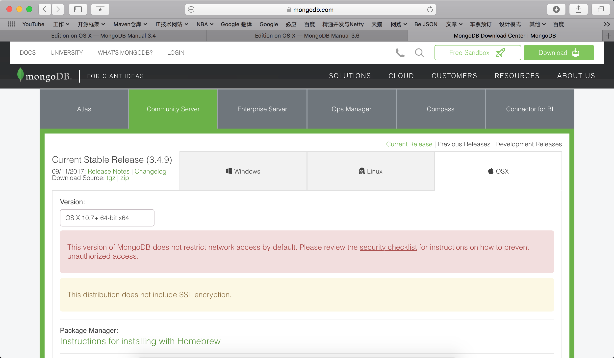
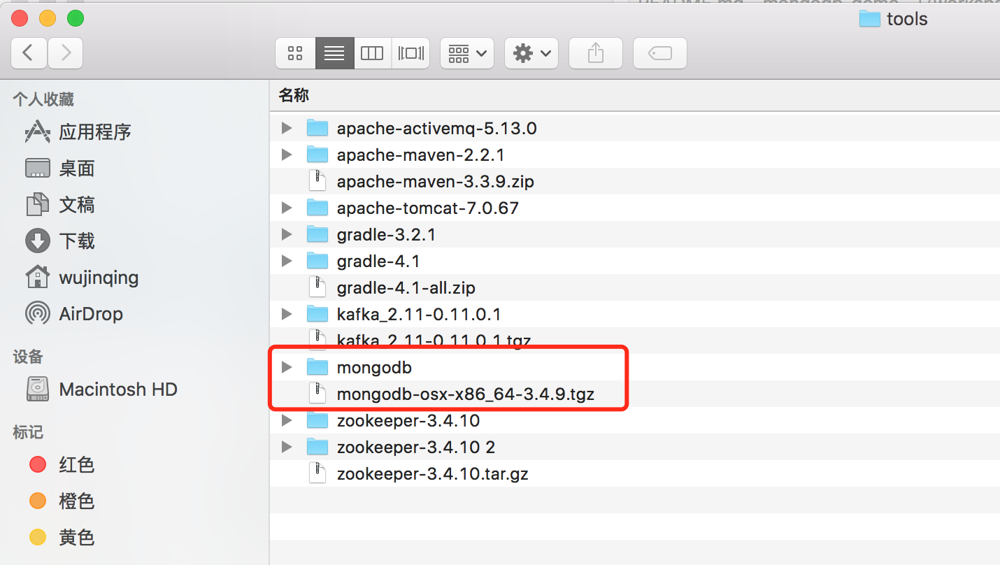
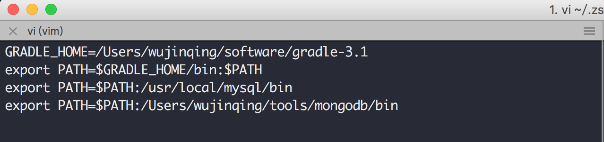
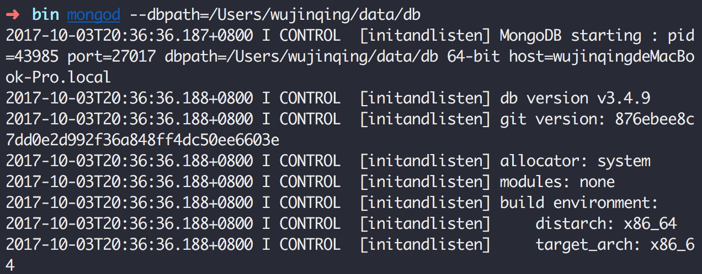
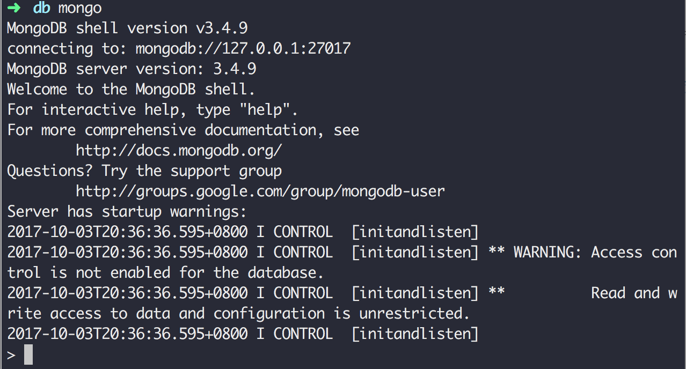

## MongoDB学习笔记

### 安装MongoDB
> 版本：mongodb-osx-x86_64-3.4.9.tgz

> 官网地址：https://www.mongodb.com/download-center#community

##### 1.下载MongoDB

##### 2.解压并重命名

##### 3.配置环境变量

##### 4.启动MongoDB服务端

> 启动MongoDB服务端：mongod --dbpath=/Users/wujinqing/data/db 或者mongod

> 参数说明：

> --dbpath=/Users/wujinqing/data/db 指定数据库文件存放的路径，

> 默认保存在根目录下的/data/db下

##### 5.启动MongoDB客户端

> 启动MongoDB客户端: mongo默认连接到本地的27017端口

