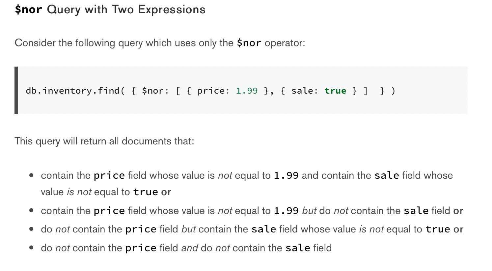
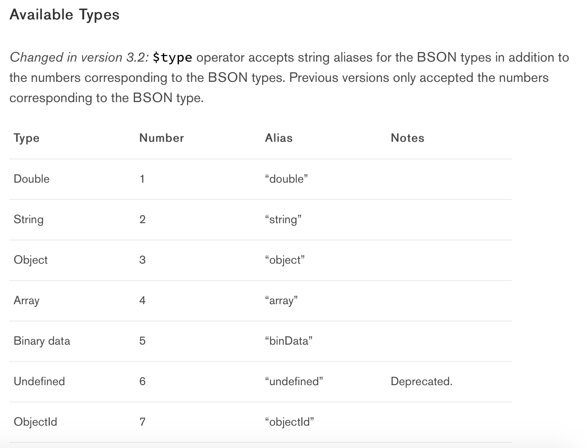
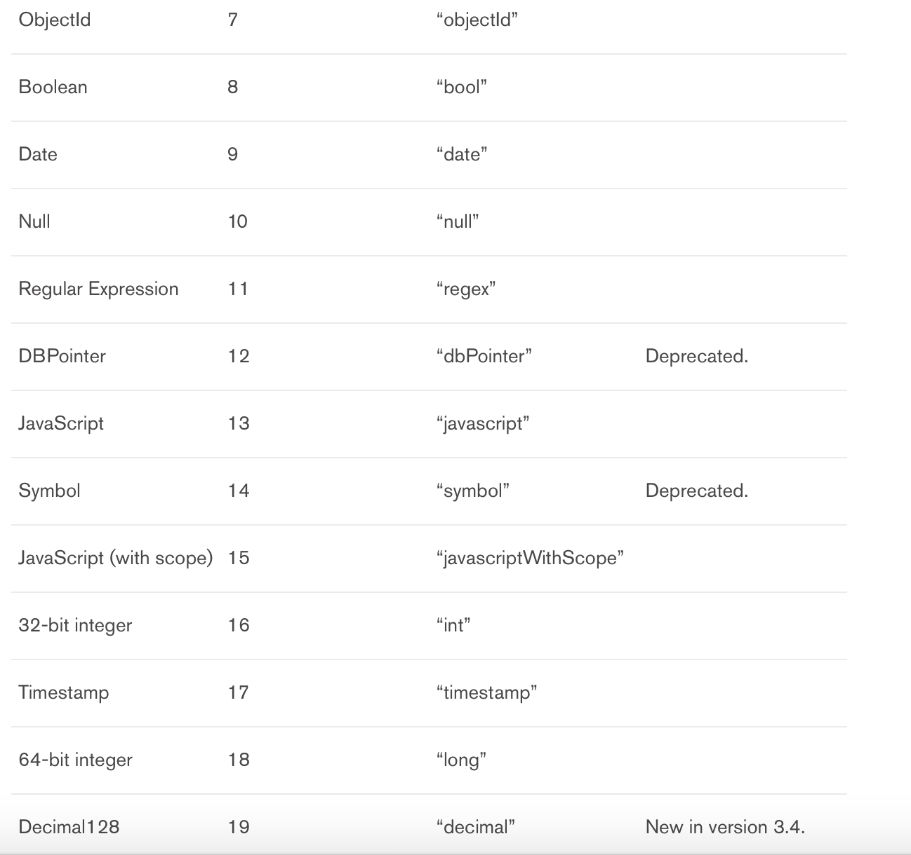
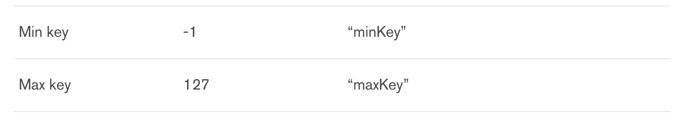

# Query and Projection Operators查询器

### Query Selectors 查询选择器

##### 比较运算符

|名称|描述|用法|
|---|---|---|
|$eq|’=’， 等于|{field: {$eq: value} }|
|$ne|‘!=’， 不等于|{field: {$ne: value} }|
|$gt|‘>’, 大于|{field: {$gt: value} }|
|$gte|‘>=’, 大于等于|{field: {$gte: value} }|
|$lt|‘<’, 小于|{field: {$lt: value} }|
|$lte|‘<=’, 小于等于|{ field: { $lte: value} }|
|$in|类似与SQL里面的in()|{ field: { $in: \[\<value1>, \<value2>, ... \<valueN> ] } }|
|$nin|类似与SQL里面的not in()|{ field: { $nin: \[\<value1>, \<value2>, ... \<valueN> ] } }|

##### 逻辑运算符

|名称|描述|用法|
|---|---|---|
|$and|逻辑运算符'与'，短路运算符|{ $and: \[ { \<expression1> }, { \<expression2> } , ... , { \<expressionN> } ] }|
|$not|逻辑运算符’非’, 未包含字段field的数据也会返回|{ field: { $not: { \<operator-expression> } } }|
|$nor|逻辑运算符‘既不也不’，只有全部表达式未true，才会返回true, 未包含字段field的数据也会返回，参考 **附录A** 示例|{ $nor: \[ { \<expression1> }, { \<expression2> }, ...  { \<expressionN> } ] }|
|$or|逻辑运算符‘或’|{ $or: \[ { \<expression1> }, { \<expression2> }, ... , { \<expressionN> } ] }|

##### Array数组运算符

|名称|描述|用法|
|---|---|---|
|$all|同时包含指定的所有元素|{ \<field>: { $all: \[ \<value1> , \<value2> ... ] } }|
|$elemMatch|数组中至少一个元素同时满足指定的所有条件|{ \<field>: { $elemMatch: { \<query1>, \<query2>, ... } } }|
|$size|数组中元素个数必须是指定个数|{ field: { $size: 2 } } |

##### Element运算符

|名称|描述|用法|
|---|---|---|
|$exists|判断是否有这个字段。|{ field: { $exists: \<boolean> } }|
|$type|判断字段是否是指定的类型列表中的其中一个，只要满足一个就行。类型参考 **[附录B](#B)**|{ field: { $type: \[ \<BSON type1> , \<BSON type2>, ... ] } }|

### 附录

##### [附录A](#A)

##### [附录B](#B)

||||

