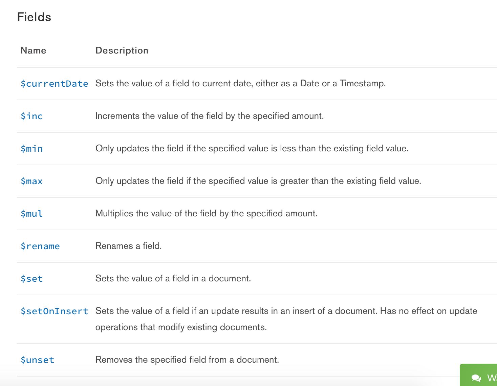
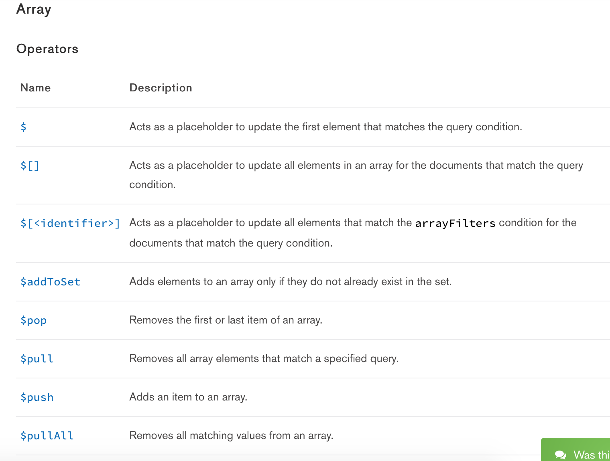
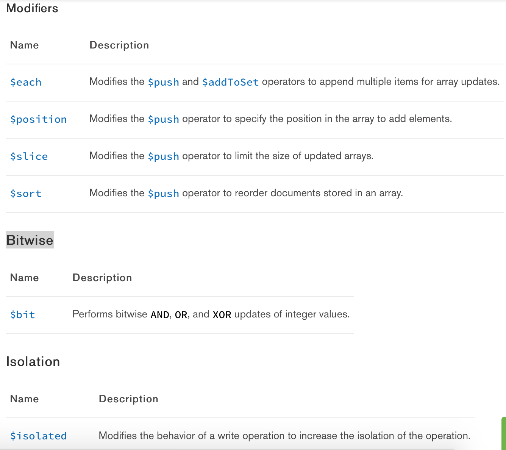

# Update Operators 修改器

* 官方文档：[Update Operators](https://docs.mongodb.com/master/reference/operator/update/)

### MongoDB 支持的所有的修改器：

### $currentDate

> 设置指定字段的值为当前时间，可以是Date或者Timestamp。

语法：
> { $currentDate: { \<field1>: \<typeSpecification1>, ... } }

### $inc

> 增加指定的字段的值为指定数量。

语法：

> { $inc: { \<field1>: \<amount1>, \<field2>: \<amount2>, ... } }

> 如果字段field不存在，则会自动新增字段，并设置默认值为amount。

> 当amount > 0时，则递增，当amount < 0时，则递减。

> 只能用于数字。

### $set

> 更新或者设置字段的值

语法：

> { $set: { \<field1>: \<value1>, ... } }

> 如果字段field不存在，则会自动新增字段，并设置默认值为value。

> 修改数组中的第一个元素( **email.0** )：db.personalinfo.update({_id:ObjectId("59d5b0847fa0475f2020e0da")}, {$set: {'email.0': 'a1@a1.com'}})

> 修改查询结果数组中的元素( **address.$.city** ), 不知道数组下标:

> db.personalinfo.update({'address.city': 'beijing'}, {$set: {'address.$.city': 'chaoyang'}}) 默认修改第一个，如果multi设置为true则会修改多个。

### $unset

> 删除指定字段。

语法：

> { $unset: { \<field1>: "", ... } }

> 字段field的值，并不会影响删除操作，可以是任意值，这个值没有实际意义。

### $push

> 向数组中追加一个元素。

语法：

> { $push: { \<field1>: \<value1>, ... } }

### $addToSet

> 向数组中追加一个元素, 如果元素已存在则不添加。

语法：

> { $addToSet: { \<field1>: \<value1>, ... } }

特点：

> 元素不重复。

### $pop

> 从数组中取出并删除一个元素。

语法：

> { $pop: { \<field>: <-1 | 1>, ... } }

> -1表示从头开始取，1表示从尾开始取。

### $each

> 向数组中追加多个元素。需要配合 **$push** 或者 **$addToSet** 使用。

语法：

> { $addToSet: { \<field>: { $each: \[ \<value1>, \<value2> ... ] } } }

> 或者

> { $push: { \<field>: { $each: \[ \<value1>, \<value2> ... ] } } }

### $pull

> 从任意位置删除一个元素。

语法：

> { $pull: { \<field1>: <value|condition>, \<field2>: <value|condition>, ... } }

