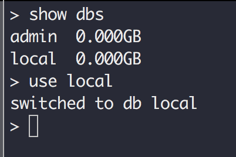

## mongo客户端命令详解

### show dbs: 显示所有数据库

> show dbs

### use 数据库名: 切换数据库

> use local

### db: 查看当前使用的数据库

> db

### show collections 查看当前所在数据库的所有集合

> show collections;

### db.hello.insert(): 向集合hello中插入数据

> db.hello.insert({name:'zhang san', age:20});

> 无模式插入

### db.hello.find(): 查找集合hello中的所有数据

> db.hello.find();

> db.hello.find().limit(2);

> db.hello.find;

### db.hello.remove({}): 删除集合hello中的所有数据

> db.hello.remove({});

### db.personalinfo.update(查询条件,新数据): 更新数据

> db.personalinfo.update({name:'zhangsan', info1},{});

