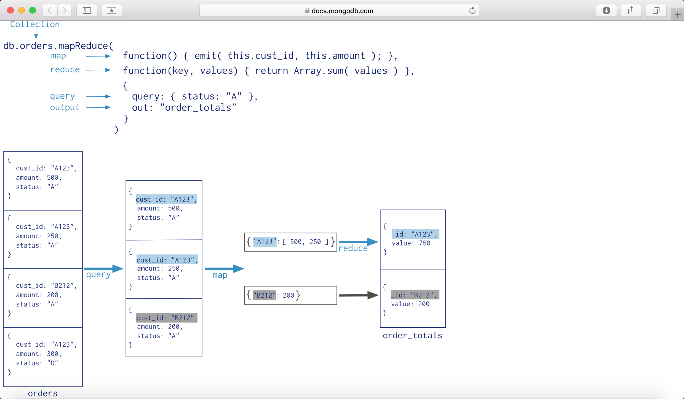

## 聚合详解

聚合的三种方式
* group函数
* MapReduce
* 聚合框架

### db.collection.group({ key, reduce, initial \[, keyf] \[, cond] \[, finalize] })

[db.collection.group](https://docs.mongodb.com/master/reference/method/db.collection.group/index.html)

##### 参数说明

|参数|类型|说明|示例|
|---|---|---|---|
|key|document|指定需要分组的一个或者多个字段|key: { ord_dt: 1, 'item.sku': 1 }|
|reduce|function|聚合函数：The function takes two arguments: the current document and an aggregation result document for that group.|key: { ord_dt: 1, 'item.sku': 1 }|
|initial|document|初始化聚合结果|initial: {totalCount: 0}|
|cond|document|筛选条件，筛选出需要分组的记录|cond: { ord_dt: { $gt: new Date( '01/01/2012' ) } }|
|keyf|function|key的替代方案|keyf: function(curr){return {name: curr.name.length}}|
|finalize|function|对分组之后的结果再次进行操作|finalize: function(aggregator){aggregator.avgAge= aggregator.totalAge / aggregator.totalCount; delete aggregator.totalCount}|

> 示例1：每组元素个数,db.mygroup.group({key: {count: true}, initial: {totalCount: 0}, reduce: function(curr, aggregator){aggregator.totalCount++}})

> 示例2：每组元素最小值，db.mygroup.group({key: {count:1}, initial:{minAge:0, count:0}, reduce: function(curr, aggregator){aggregator.count++; if(aggregator.count ==1){aggregator.minAge = curr.age};if(aggregator.minAge > curr.age){aggregator.minAge = curr.age}}})

> 示例3：求平均年龄，db.mygroup.group({key: {count:1}, initial:{minAge:0, count:0, totalAge: 0, totalCount:0}, reduce: function(curr, aggregator){aggregator.totalAge += curr.age; aggregator.totalCount++; aggregator.count++; if(aggregator.count ==1){aggregator.minAge = curr.age};if(aggregator.minAge > curr.age){aggregator.minAge = curr.age}}, finalize: function(aggregator){aggregator.avgAge= aggregator.totalAge / aggregator.totalCount}})

> 示例3：按名字长度分组，db.mygroup.group({keyf: function(curr){return {name: curr.name.length}}, initial:{minAge:0, count:0, totalAge: 0, totalCount:0}, reduce: function(curr, aggregator){aggregator.totalAge += curr.age; aggregator.totalCount++; aggregator.count++; if(aggregator.count ==1){aggregator.minAge = curr.age};if(aggregator.minAge > curr.age){aggregator.minAge = curr.age}}, finalize: function(aggregator){aggregator.avgAge= aggregator.totalAge / aggregator.totalCount; delete aggregator.totalCount}})

### db.collection.mapReduce(map, reduce, {\<out>, \<query>, \<sort>, \<limit>, \<finalize>, \<scope>, \<jsMode>, \<verbose>})

[db.collection.mapReduce](https://docs.mongodb.com/master/reference/method/db.collection.mapReduce/#db.collection.mapReduce)

### 附录

### 附录A

[地址](https://docs.mongodb.com/master/core/map-reduce/)