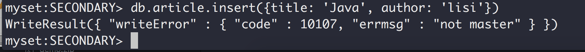

## 命令参数说明

### mongod 启动服务器

|参数|说明|示例|
|---|---|---|
|dbpath|指定数据库存放位置，默认：/data/db|mongod --dbpath=/Users/wujinqing/tools/mongodb-3.6.5/data/db|
|bind_ip|绑定ip, 这样远程才能连接|mongod --dbpath=/Users/wujinqing/tools/mongodb-3.6.5/data/db --bind_ip 127.0.0.1|
|logpath|指定日志文件路径|mongod --dbpath=/Users/wujinqing/tools/mongodb-3.6.5/data/db --bind_ip 127.0.0.1 --logpath=/Users/wujinqing/tools/mongodb-3.6.5/log/mongod.log|

### mongofiles GridFS命令行工具

格式：mongofiles options commands filename

#### Options

|参数|说明|
|---|---|
|--uri <connectionString>|连接url，mongodb://\[username:password@]host1\[:port1]\[,host2\[:port2],...\[,hostN\[:portN]]]\[/\[database]\[?options]]|
|--host <hostname><:port>|指定服务器和端口号|
|--port <port>|指定端口号|
|--username <username>, -u <username>|指定用户名|
|--password <password>, -p <password>|指定密码|
|--db <database>, -d <database>|指定数据库|
|--collection <collection>, -c <collection>|指定集合|
|--local <filename>, -l <filename>|指定要上传的源文件|

Commands
|参数|说明|
|---|---|
|list <prefix>|列出以prefix开头的所有文件，prefix可以选 |
|search <string>|查询文件名包含给定字符串的文件, string不能省略|
|put <filename>|上传文件，filename用来指定文件上传后在数据库中存放的文件名称|
|get <filename>|下载文件，需要通过-l 指定目标文件名及路径|
|get_id "<ObjectId>"||
|delete <filename>|删除文件|
|delete_id "<ObjectId>"||
|||

Filename 数据库中存放的文件名

### mongostat 查看mongo服务或副本集状态信息

|参数|说明|
|---|---|
|--host|主机信息|
|-u|用户名|
|-p|密码|
|--json|以json文档的形式输出|

单机
> mongostat --host localhost:28010

副本集
> mongostat --host=myset/localhost:28010,localhost:28011,localhost:28012

|参数|说明|
|---|---|
|host|主机信息|
|insert|插入操作数量|
|query|查询操作数量|
|update|更新操作数量|
|delete|删除操作数量|

host insert query update delete getmore command dirty used flushes vsize   res qrw arw net_in net_out conn   set repl

